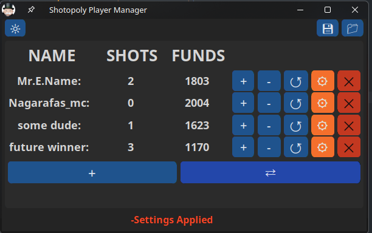

# Shotopoly-Player-Manager

**Shotopoly** is a simple **ruleset* that can be applied to any classic monopoly game and is aimed towards those who would like to get drunk with friends.

This Python app is designed to help with this **ruleset**
- Allows you to add players with custom names
- Increase/Decrease shots utilized and money earned from the Bank
- Player Transactions for rent
- Session saves & autosaves incase you close the app by mistake

## REQUIREMENTS

You'll need a python 3.1X.X instalation
and the following extra Libraries in order to run the app straight from the .py file
- Customtkinter
- base64

## INSTALATION

No need, you can just run the app, although a windows Executable will be provided within a zip in 

- [PYTHON](https://www.python.org/downloads/windows/) 

## Shotopoly ruleset:
[to be added]
